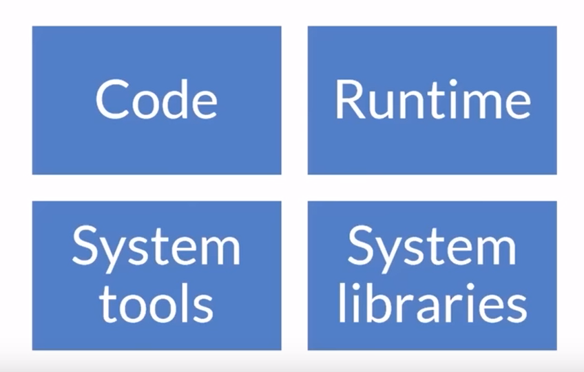
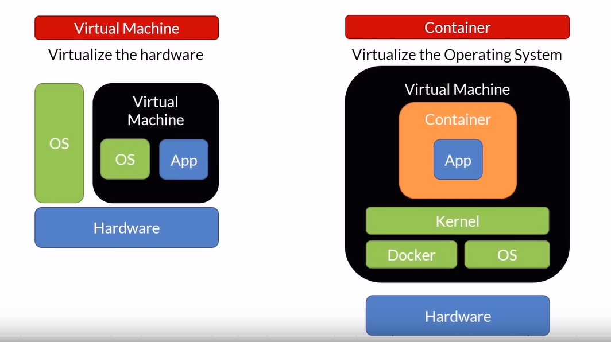

# Docker - everything you need to know

## Containers
It is a unit of software/deployment.

## Why Containers?
- Move faster by deploying smaller units
- Use fewer resources
- Fit more into the same host
- Faster automation
- Portability - run them anywhere
- Isolation - if one fails, it won't take the system down

## Virtual Machines vs Containers

### How Containers work?
Containers work by creating “namespaces”, which are a Linux feature that group shared resources together. For example, if you had five processes running together within a Docker container, they’d still be running within Linux itself.

### How VMs work?
If the idea of containers was to provide a “fake” version of Linux, the idea for VMs is to provide “fake” versions of the CPU, RAM, disk and devices. That is, VMs are “faking” one level deeper.

|Virtual Machines|Containers|
|---|---|
|Large Footprint|Lightweight|
|Slow to boot|Quick to start (it does not have to boot)|
|Ideal for long running tasks|Ideal for short lived tasks|
|Not so portable|Portable|

## Container Registry
It is centralized container repository, like GitHub but for containers. Docker has DockerHub (https://hub.docker.com). All major cloud providers have their own Container Registry.

## Orchestrator
It is a thing that manages:
- Infrastructure
- Containers
- Deployment
- Scaling
- Failover
- Health Monitoring
- App upgrades, Zero-Downtime deployments

Example, **Kubernetes**, Swarm, Service Fabric
There are some orchestrator as a service, like, Azure Kubernetes Service, Service Fabric

## What is Docker?
- An open source **container runtime**
- Runs on Mac, Windows and Linux
- Command line tool to create containers
- "Dockerfile" format for building container images

## Docker compose?
- Define and run multi-containers applications
- Define using YAML file
- Run using the docker CLI with the compose plugin (docker compose)
- https://docs.docker.com/compose/