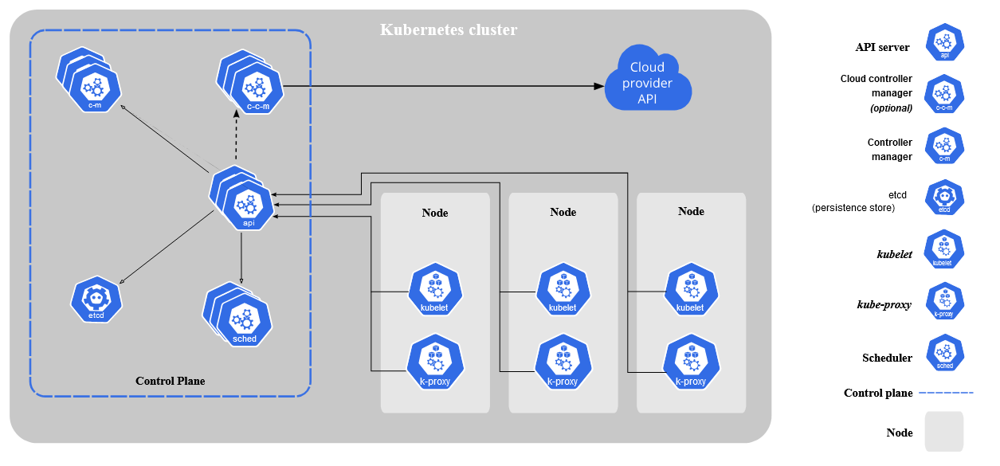
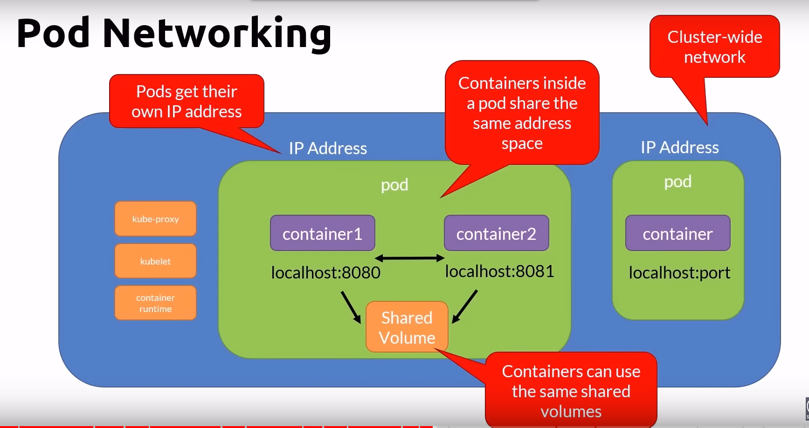
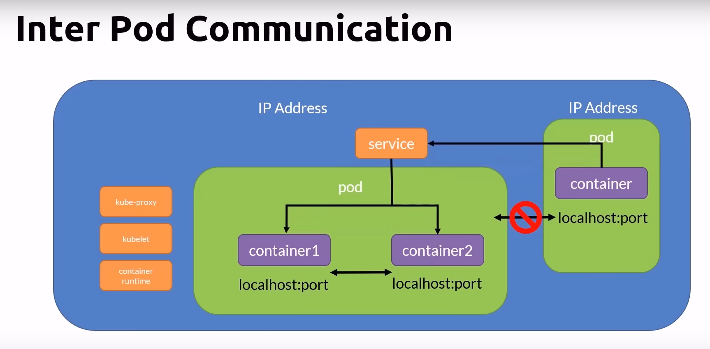
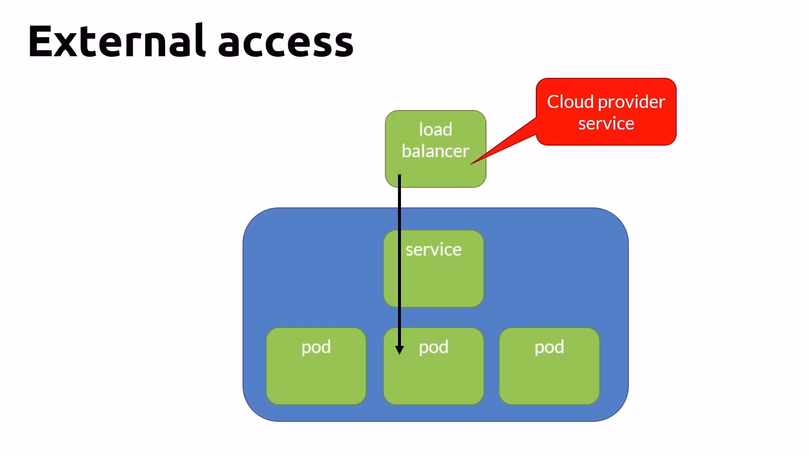

# Kubernetes - everything you need to know

- K8s is the leading container orchestration tool (See Orchestrator in Docker.md)
- Designed as a loosely coupled collection of components centered around deploying, maintaining and scaling workloads
- Vendor-neutral, runs on all cloud providers

## What K8s CAN do
- Service discovery and load balancing
- Storage orchestration, local or cloud based
- Automated rollouts and rollbacks
- Self-healing
- Secret and configuration management
- Use the same API across on-premise and every cloud providers

## What K8s CAN'T do
- Does not deploy source code
- Does not build your application
- Does not provide application-level services, message buses, databases, caches, etc.

## Architecture



- **Nodes** - A node is a physical or virtual machine
- **Cluster** - A group of nodes forms a cluster

### **Master Node / Control Plane**
K8s services and controllers are located here. You don't run containers in master node.
- **etcd** - Key value data store that stores state of the cluster
    - Not a database or a datastore for applications to use
    - Single source of truth
- **kube-apiserver** - The only component that communicates with etcd
    - REST interface
    - Save state to the etcd datastore
    - All clients interact with it, never directly to the datastore

- **kube-control-manager** - controller of controllers, it runs controllers
    - Node controller
    - Replication controller
    - Endpoints controller
    - Service account and Token controllers

- **cloud-control-manager** - interact with the cloud providers controllers

- **kube-scheduler** - watches newly created pods that have no node assigned, and selects a node for them to run on
    - Factors taken into account scheduling decisions include
        - Individual and collective resouce requirements
        - Hardware/software/policy constraints
        - Affinity and anti-affinity specifications
        - Data locality

- **Addons** - DNS, Web UI (dashboard), Cluster-level logging, Container resource monitoring

### **Worker Nodes**
Nodes running the containers are called worker nodes. When a worker node is added to the cluster, some of the K8s services are added automatically, which are - 
- **container runtime** - K8s supports several container runtimes, must implement K8s Container Runtime Interface
- **kubelet** - Manage the pods lifecycle, ensures that the containers described in the Pod specs are runninng and healthy
- **kube-proxy** - a network proxy, manager network rules on nodes

**Nodes Pool**
- A node pool is a group of virtual machines, all with the same size
- A cluster can have multiple node pools
    - these pools can host different sizes of VMs
    - Each pool can be autoscaled independently from the other pools
- Docker desktop is limited to 1 node

## K8s Context
- A context is a group of access parameters to a K8s cluster
- Contains a Kubernetes cluster, a user, and a namespace
- The current context is the cluster that is currently the defaut for kubectl
- All kubectl commands run against that current context cluster

## K8s Namespace
- Allow to group resources. Ex: dev, test, prod
- K8s creates a default namespace
- Objects in one namespace can access objects in a different one, Ex: objectname.prod.svc.cluster.local
- Deleting a namespace will delete all its child objects
- Define a namespace, and specify that namespace when defining objects (pod, network policy, resource quota etc.)

## Pods
- Atomic unit of the smallest unit of work of K8s
- Encapsulates an application's container
- Represents a unit of deployment
- Pods can run one or more containers
- Containers within a pod share - IP address space, mounted volumes
- Containers within a pod can communicate via - localhost, IPC
- Pods are ephemeral
- Deploying a pod is an atomic operation, it succeeds or fails
- If a pod fails, it is replaced with a new one with a shiny new IP address
- You don't update a pod, you replace it with an updated version
- You scale by adding more pods, not more containers in a pod
- A node can run many pods, a pod can have multiple containers
- State of pod can be one of these - Pending, Running, Succeeded, Failed, Unknown, CrashLoopBackOff

## Init Containers
- Initialize a pod before an application container runs
- This is great pattern for applications that have dependencies on some database or API that needs to be up and running before the application
- This keeps the infrastructure code out of the main logic
- These always run to completion
- There can be multiple init containers
- Each init container must complete successfully before the next one starts
- If it fails, the kubelet repeatedly restarts it until it succeeds
    - Unless it's restart policy is set to never

## Labels
- key-value pairs used to identify, describe and group related sets of objects or resources
```yml
apiVersion: v1
kind: Pod
metadata:
    name: myapp-pod
    labels:
        app: myapp
        type: front-end
    spec:
        containers:
        - name: nginx-container
          image: nginx
```

## Selectors
- Selectors use labels to filter or select objects
- For example, for the given pod definition, the pod will run on a **node** which has disk type: superfast (`select * from nodes where disktype = superfast`)
```yml
apiVersion: v1
kind: Pod
metadata:
    name: myapp-pod
    labels:
        app: myapp
        type: front-end
    spec:
        containers:
        - name: nginx-container
        nodeSelector:
          disktype: superfast
```

## Multi-container pods
- In a pod, multiple containers can run at once, usually there is a main container and an helper container
- There are some typical patterns in this scenario
- Sidecar pattern, Adapter pattern, Ambassador pattern

# Networking Concepts
- All containers within a pod can communicate with each other
- All pods can communicate with each other
- All nodes can communicate with all pods and nodes
- **Pods** are given an **ephemeral** IP address
- **Services** are given a **persistent** IP address




