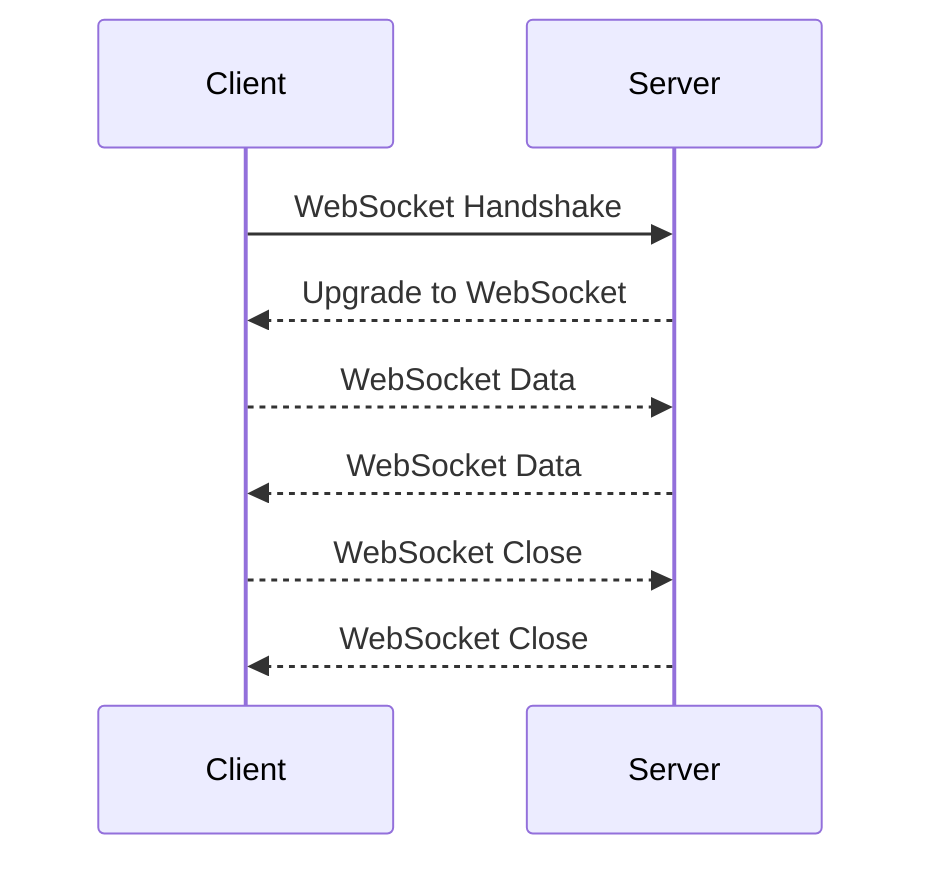
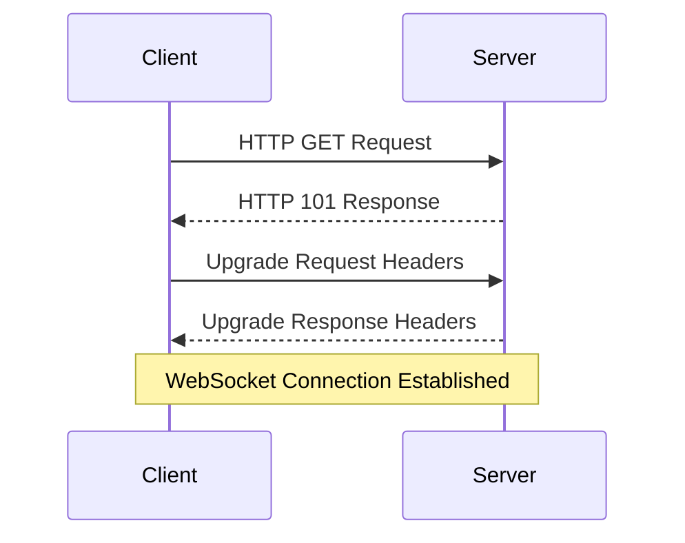

A WebSocket is a communication protocol that provides full-duplex communication channels over a single TCP connection. It enables real-time, bi-directional communication between a client (typically a web browser) and a server.

It allows **ongoing and persistent connections** where both the client and the server can initiate communication at any time.

### Use Cases
- Web apps that require real-time data updates or interactive features, example, stock trading, chat apps, collaborative editing tools (google docs), online gaming etc.




## Web Socket handshake
The WebSocket handshake is the initial process that occurs between a client and a server when establishing a WebSocket connection. It involves a series of steps to negotiate and upgrade the HTTP protocol to the WebSocket protocol. The handshake ensures that both the client and the server are capable of supporting WebSocket communication.


## WebSocket frame

A WebSocket frame is the smallest unit of data that can be sent or received over a WebSocket connection. It represents a single message or a part of a message being exchanged between the client and the server.
It consists of a structured format that includes
- a header
- an optional payload data
The header contains control information about the frame, such as the opcode, length and masking key (if applicable). 
The payload data carries the actual content of the message.

Key components of a WebSocket frame:
	1. **Opcode**: it indicates the type of frame and how the data should be interpreted, common opcodes are:
		- **Continuation (0x0)**: Part of a fragmented message.
		- **Text (0x1)**: Contains UTF-8 encoded text data.
		- **Binary (0x2)**: Contains binary data.
		- **Close (0x8)**: Indicates the connection should be closed.
		- **Ping (0x9)**: Sent by the sender to request a pong response.
		- **Pong (0xA)**: Sent by the receiver in response to a ping frame.
	2. **Length**: It specifies the length of the payload data, allowing for frames of varying sizes. The length can be encoded in different ways depending on the value:
		- Payload Length <= 125: The length is represented directly in the frame header
		- Payload Length = 126: The following 2 bytes are used to represent a 64-bit unsigned integer, giving the actual payload length
		- Payload Length = 127: The following 8 bytes are used to represent a 64-bit unsigned integer, giving the actual payload length
	3. Masking Key (optional): If the frame is sent by the client, it may include a 32-bit masking key. The masking key is used to mask the payload data for security reasons. If the frame is sent by the server, it does not include a masking key.
	4. Payload Data: It contains the actual data being sent. The length of the payload data is determined by the length specified in the frame header.

WebSocket frames are used to facilitate bidirectional communication between the client and the server, allowing them to exchange messages in real-time. Frames can be sent individually or as part of a fragmented message when the message data exceeds the frame's payload length.

It's important to note that WebSocket frames are different from the HTTP request and response messages used during the initial WebSocket handshake. Once the handshake is complete, WebSocket frames are used for ongoing data exchange.

## WebSocket handshake example

```curl
curl -i -N -H "Connection: Upgrade" -H "Upgrade: websocket" -H "Sec-WebSocket-Version: 13" -H "Sec-WebSocket-Key: dGhlIHNhbXBsZSBub25jZQ==" http://example.com/chat
```

-   `-i`: Includes the response headers in the output.
-   `-N`: Disables output buffering, allowing the response to be displayed immediately.
-   `-H`: Specifies custom headers to be sent in the request.
    -   `Connection: Upgrade`: Indicates the desire to upgrade the connection.
    -   `Upgrade: websocket`: Specifies the protocol to upgrade to WebSocket.
    -   `Sec-WebSocket-Version: 13`: Specifies the version of the WebSocket protocol being used (version 13).
    -   `Sec-WebSocket-Key: dGhlIHNhbXBsZSBub25jZQ==`: Provides a base64-encoded key for the WebSocket handshake.
-   `http://example.com/chat`: Specifies the URL of the WebSocket server where the handshake is being initiated. Adjust the URL as per your specific WebSocket server configuration.