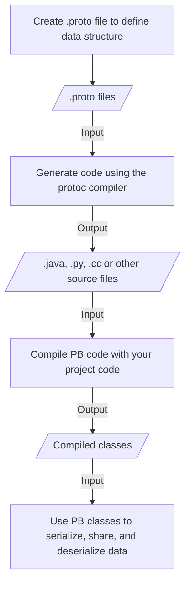

# Protocol Buffers

- it is a free and open-source, cross-platform data format
- used to serialize structured data in a forward-compatible and backward-compatible way
- its like JSON, except it's smaller and faster, and it generates native language bindings

Protocol buffers are a combination of 
- the definition language (`.proto` files)
- code that `protoc` (proto compiler) generates to interface with data
- language-specific runtime libraries
- serialization format for data

# Why Protocol Buffers?
- it provides serialization format for packets of typed, structured data that are up to a few megabytes in size
- this format is suitable for both ephemeral networks as well as long-term storage
- Advantages
    - Compact data storage
    - Fast parsing
    - Availability in many programming languages
    - Optimized functionality through auto-generated classes

# Workflow

# Syntax

[Language Guide proto3](https://protobuf.dev/programming-guides/proto3/)

# Example project

Checkout ./example directory: [Protobuf example](./example/) 