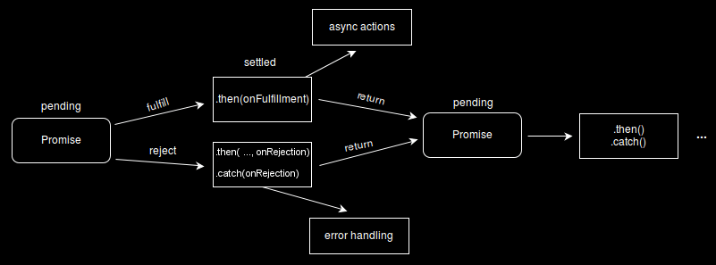

# Promise

The `Promise` object represents the eventual completion (or failure) of an asynchronous operation and its resulting value.

It is a proxy for a value not necessarily known when the promise is created. It allows you to associate handlers with an asynchronous action's eventual **success value** or **failure reason**.

This lets asyn methods return values like synchronous methods: instead of immediately returning the final value, the asynchronous method returns a *promise* to supply the value at some point in the future.

A promise can be in one of the following 3 states:

- *pending*: initial state, neither fulfilled nor rejected
- *fulfilled*: meaning that the operation was completed successfully
- *rejected*: meaning that the operation failed

When either of these options occur, the associated handlers queued up by a promise's `then` method are called.
The `then` method also returns a promise, so they can be chained together to do anything. Look at the diagram below:




## Chaining Promises

The `.then()`, `.catch()` and `.finally()` method also return promises.

```js
myPromise
    .then(handleFulfilledA)
    .then(handleFulfilledB)
    .then(handleFulfilledC)
    .catch(handleRejectedAny)
```

## Code Example

```js
/**
 * You started a search for an uber driver, => promise pending
 * The driver arrived at your location => promise fulfilled
 * The driver rejected your request => promise rejected
 */

let arrived = true;

// creating a promise
const ride = new Promise((resolve, reject) => {
    if(arrived) {
        resolve("Driver arrived! + ride data"); // resolve the promise with some data
    }
    else {
        reject("Driver not arrived! ERROR"); // reject the promise with an error and a reason
    }
});


// consuming a promise
ride
    .then(value => {
        // data that was resolved in the promise
        console.log(value);
    })
    .catch(error => {
        // error and reason that sent via reject method
        console.log(error);
    })
    .finally(() => {
        console.log("Process completed!")
    });


```