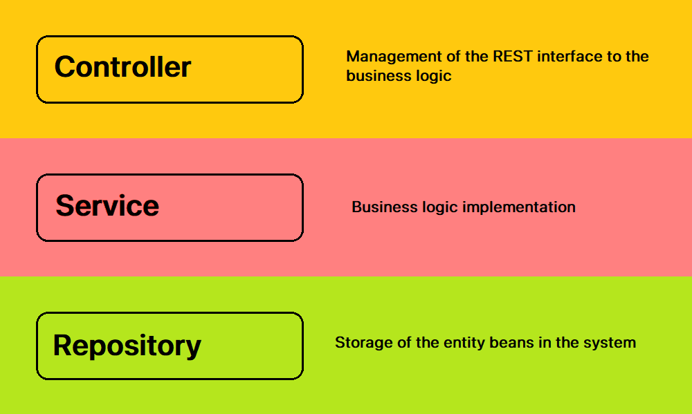

# Controller-Service-Repository
This is a layer pattern for building a backend, it is quite famous in Spring Boot. 

- Separation of concerns
- Easy to write unit tests

## Controller Layer
Solely responsible for exposing the functionality so that it can be consumed by external entities (UI)

## Service Layer
All the business logic goes to the service layer

## Repository Layer
Reponsible for storing and retrieving some set of data