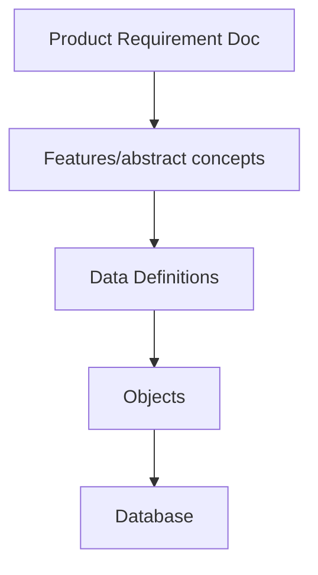

# How to design a system?

Once you have the database scheme, you can now expose endpoints to manipulate that data. You should know what network protocols to use to access this data.

But there are some engineering requirements to consider:

1. Fault Tolerance: no downtime of your product
2. Extensibility: how easy is to change your product to incorporate new features?
3. Testing: test your product, load, performance etc.