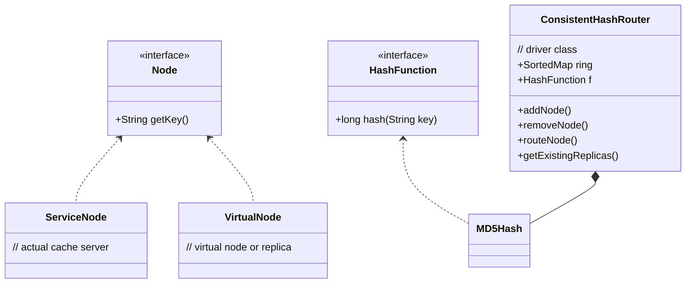

# Distributed Cache - Consistent Hashing

## Theory

[Consistent Hashing - akshat's notes](https://akormous.github.io/notes/docs/microservices/ConsistentHashing)

## Class Diagram

```mermaid
classDiagram

class Node {
    <<interface>>
    +String getKey()
}

class HashFunction {
    <<interface>>
    +long hash(String key)
}

class ServiceNode {
    // actual cache server
}

class VirtualNode {
    // virtual node or replica
}

class MD5Hash

class ConsistentHashRouter {
    // driver class
    +SortedMap<Long, VirtualNode> ring
    +HashFunction f
    +addNode()
    +removeNode()
    +routeNode()
    +getExistingReplicas()
}

Node <.. ServiceNode
Node <.. VirtualNode

HashFunction <.. MD5Hash

ConsistentHashRouter *-- MD5Hash

```

