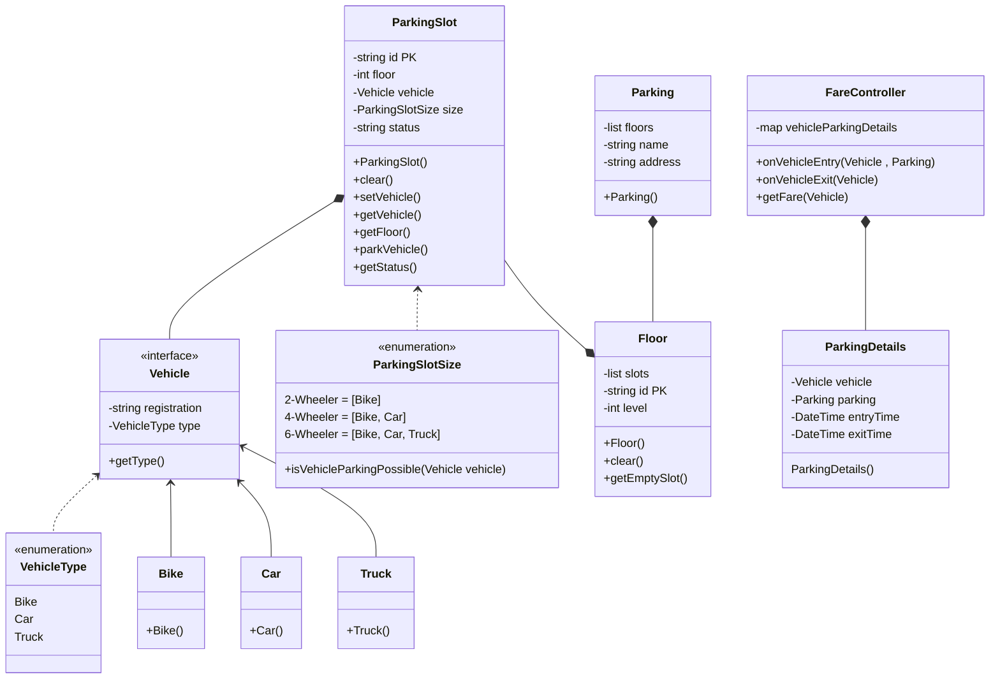

# Parking Lot

```mermaid
classDiagram
direction TB

class VehicleType {
    <<enumeration>>
    Bike
    Car
    Truck
}

class Vehicle {
    <<interface>>
    -string registration
    -VehicleType type
    +getType()
}

class Bike {
    +Bike()
}

class Truck {
    +Truck()
}

class Car {
    +Car()
}

Vehicle <.. VehicleType

Vehicle <-- Bike
Vehicle <-- Car
Vehicle <-- Truck


class ParkingSlotSize {
    <<enumeration>>
    2-Wheeler = [Bike]
    4-Wheeler = [Bike, Car]
    6-Wheeler = [Bike, Car, Truck]
    +isVehicleParkingPossible(Vehicle vehicle)
}

class ParkingSlot {
    -string id PK
    -int floor
    -Vehicle vehicle
    -ParkingSlotSize size
    -string status
    +ParkingSlot()
    +clear()
    +setVehicle()
    +getVehicle()
    +getFloor()
    +parkVehicle()
    +getStatus()
}

class Floor {
    -list<ParkingSlot> slots
    -string id PK
    -int level
    +Floor()
    +clear()
    +getEmptySlot()
}

class Parking {
    -list<Floor> floors
    -string name
    -string address
    +Parking()
}

ParkingSlot <.. ParkingSlotSize
Parking *-- Floor
ParkingSlot --* Floor

ParkingSlot *-- Vehicle

class ParkingDetails {
    -Vehicle vehicle
    -Parking parking
    -DateTime entryTime
    -DateTime exitTime

    ParkingDetails()
}

class FareController {
    -map<Vehicle, ParkingDetails> vehicleParkingDetails
    +onVehicleEntry(Vehicle , Parking)
    +onVehicleExit(Vehicle)
    +getFare(Vehicle)
}

FareController *-- ParkingDetails

```