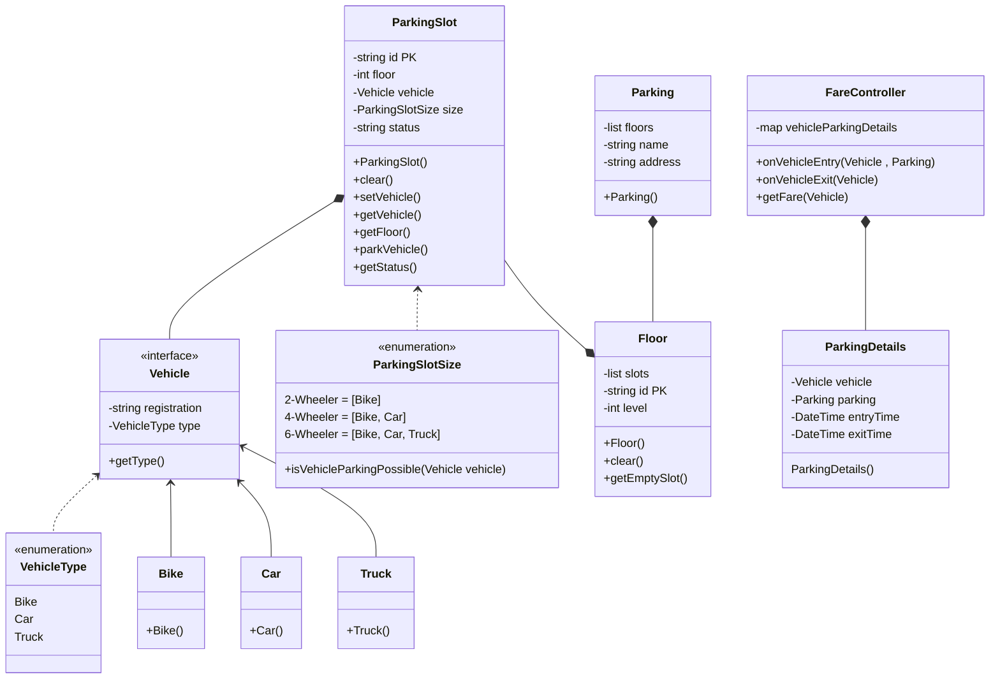

# Parking Lot

## Use Cases
1. Park a vehicle
2. Get fare for the time vehicle is parked
3. Types of vehicle that can be parked, separate spaces for each type of vehicle

## Constraints
1. Parking space, limited number of vehicles can be parked

## Basic Design
1. Vehicle (interface) -> Bike, Car, Truck (Concrete classes)
2. Track time on entry and exit of a vehicle
3. Different spots for vehicle ( enum )

## Bottlenecks
1. One type of parking gets full, while others could be empty

## Scalability
1. From one floor to multiple floors

